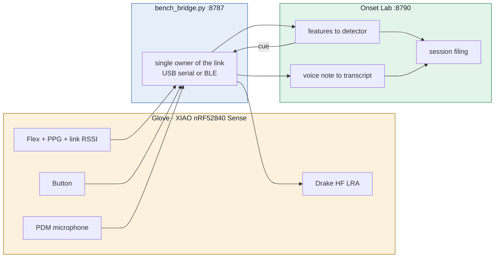

<div align="center">

# Amulet XPL

**A wearable that notices the moment you start falling asleep, and taps you awake to ask what you were dreaming.**

<!-- Drop a hero photo of the glove here -->
<!--  -->

`Seeed XIAO nRF52840 Sense` · `Flex + PPG + link RSSI` · `Drake HF LRA` · `On-device speech-to-text`

</div>

---

## What this is

Amulet XPL is a Dormio-style sleep-onset device. It does **not** classify sleep stages. It watches
for the moment the wearer stops looking like their own awake self, fires a haptic cue on the wrist
so they surface into hypnagogia, and records a spoken dream report before it fades.

The whole thing is three layers, and the boundary between them is a single line-oriented text
protocol that runs identically over USB serial and Bluetooth:



**No intelligence runs on the board.** It streams raw samples and plays what it is told. Every
decision — the baseline, the detector, the threshold, the cue — happens on the laptop, where it can
be logged, replayed and argued with.

---

## Status

| Subsystem | State | Notes |
|:--|:--|:--|
| Firmware `bench4_live` | 🟢 working | Flex + PPG @100 Hz, beats, link RSSI, mic, button, battery |
| Bluetooth link | 🟢 working | Nordic UART, `Amulet-XPL`, 99.5 lines/s, 0 dropped over 20 s |
| Battery telemetry | 🟢 working | `V` line at 2 Hz; measured **7 h 19 m** runtime on a 120 mAh cell |
| Onset detector | 🟡 unvalidated | Dormio baseline rule; **never tested against real ground truth** |
| Haptic cue | 🟡 partial | 150 ms tap only; parametric patterns not parsed by firmware |
| Voice notes | 🟢 working | On-device transcription, 0.15 s for a 3 s clip |
| Ground truth | 🔴 missing | The Ogilvie probe has not been used in any recorded session |
| Enclosure / CAD | 🟡 in progress | Iterating; not yet in this repo |

**Read [`docs/01-overview.md`](docs/01-overview.md) before trusting any number in this repo.**
Five real sessions have been recorded. None of them has a labelled sleep onset, so the detector's
accuracy is presently unknown — see [Known problems](#known-problems).

---

## Repository layout

```
amulet-xpl/
├── docs/              ← start here
├── firmware/          ← Arduino sketch for the XIAO nRF52840 Sense
│   └── bench4_live/
├── software/
│   └── onset-ml/      ← bridge, detector, GUI, session filing, transcription
└── hardware/
    ├── bom.md         ← bill of materials
    ├── wiring/        ← build guides (open the .html files in a browser)
    └── cad/           ← enclosure models
```

---

## Quick start

You need a Mac (Apple Silicon, macOS 26+ for on-device transcription), Python 3.12, and a
XIAO nRF52840 Sense flashed with `bench4_live`.

```bash
git clone <this repo> && cd amulet-xpl/software/onset-ml
uv venv --python 3.12 && uv pip install numpy scipy scikit-learn pandas pyserial bleak
make -C tools/apple_stt            # builds the on-device speech CLI

.venv/bin/python tools/bench_bridge.py      # terminal 1 — owns the board
.venv/bin/python live.py                    # terminal 2 — the cockpit
open http://localhost:8790
```

No hardware? The whole stack runs against a simulated board:

```bash
.venv/bin/python tools/fake_board.py --port 8799
ONSET_BRIDGE=http://localhost:8799 .venv/bin/python live.py
```

Full runbook: [`docs/06-running-a-session.md`](docs/06-running-a-session.md)

---

## Documentation

| | |
|:--|:--|
| [**01 · Overview**](docs/01-overview.md) | What the device does and the science it rests on |
| [**02 · Hardware**](docs/02-hardware.md) | Boards, pin map, power, the things that bit us |
| [**03 · Firmware**](docs/03-firmware.md) | `bench4_live` structure, build and flash |
| [**04 · Protocol**](docs/04-protocol.md) | Every line and command, both directions |
| [**05 · Software**](docs/05-software.md) | Bridge, detector, GUI, transcription |
| [**06 · Running a session**](docs/06-running-a-session.md) | The operator runbook |
| [**07 · Data**](docs/07-data.md) | Capture format, session files, how to load them |
| [**08 · Research notes**](docs/08-research.md) | Dormio, the physiology, what the evidence supports |
| [**09 · Troubleshooting**](docs/09-troubleshooting.md) | Every failure mode we have actually hit |

---

## Known problems

Honest list. These are the things a new engineer needs to know before they trust anything here.

1. **No ground truth exists yet.** The Ogilvie probe (a faint tone every 20 s, two misses = onset)
   has never been switched on during a recorded session, so no session carries a labelled onset.
   Every detector number in this repo comes from synthetic data.
2. **The detector runs away when the sensor moves.** In the 2 h 36 m overnight run on 21 Sep, the
   flex reading jumped 102 counts in one minute when the hand released the strip. The Dormio rule
   compares against a fixed 120 s baseline and never re-baselines, so the condition stayed true and
   the cue fired **92 times at the 60 s refractory floor** until the battery died.
3. **Voice notes are capped at 3 seconds.** `REC_SECONDS` is 3, which is 96 KB of the board's
   213 KB free RAM. Test reports are already being cut off mid-sentence.
4. **The cue can only tap.** The pattern editor in the GUI produces a `DB k=v` line the firmware
   does not parse. Arming fires a 150 ms tap and nothing else.
5. **`fsr_dropout30` never trips.** It anchors its floor on the row's own start. It is the one
   feature designed to catch problem 2.

---

## Licence & data

Code is [MIT](LICENSE). **Recorded sessions, audio and dream transcripts are not in this repo and
should not be added to it** — they are personal physiological data. `data/` is gitignored; see
[`docs/07-data.md`](docs/07-data.md) for how session files are laid out locally.
