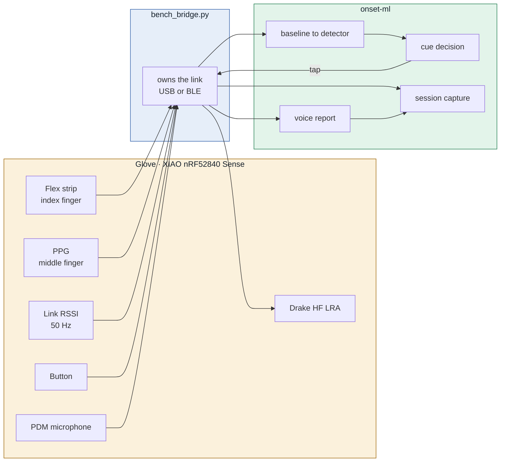
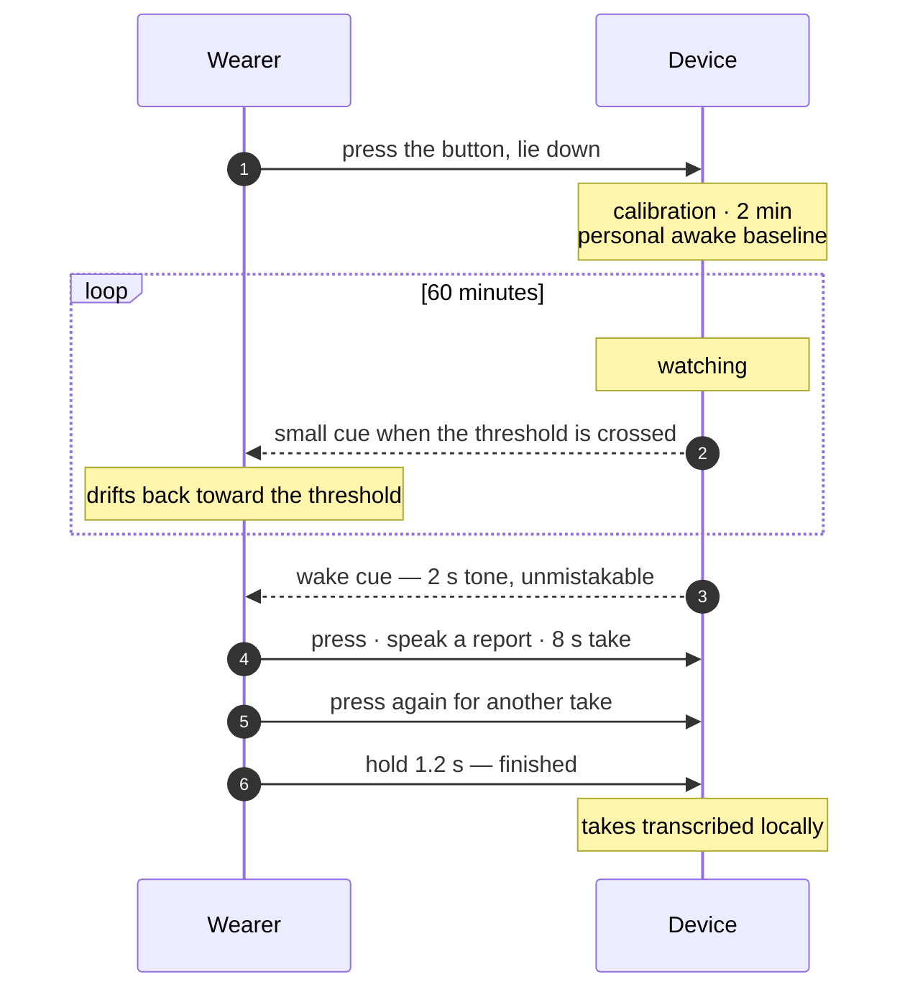

<div align="center">

# Amulet XPL

**A hypnagogic threshold device.** It detects the moment sleep begins, holds the wearer at that
threshold with small haptic cues, and records the RF signature of the whole descent.

<!--  -->

`XIAO nRF52840 Sense` · `Flex + PPG` · `Drake HF LRA` · `BLE RSSI capture` · `On-device voice report`

</div>

---

## What it is for

Two things at once, and the second one is the reason the first exists.

**1 · Hold the wearer at the hypnagogic threshold.**
Sleep onset is detected from grip collapse (flex strip) and cardiac change (PPG), both measured
against the wearer's own calibrated baseline. When they cross, a small haptic cue on the wrist
lifts them back toward wakefulness without waking them fully. Repeat for the session duration and
the wearer spends an hour oscillating inside the hypnagogic window instead of passing through it
in ninety seconds.

**2 · Capture RSSI through that state, continuously.**
The board measures the radio link's own signal strength at 50 Hz for the entire session and puts
it in the same file, on the same clock, as the physiological channels. That yields something
otherwise very hard to get: **RF data labelled by verified sleep state, from a wearer whose state
is being actively controlled.**

That labelled corpus is the deliverable. The long-term aim at DUST is sensing this state from the
RF channel *alone* — no glove, no electrodes, nothing worn. The glove exists to generate the
ground truth that makes RF-only inference trainable.

> The board measures **RSSI** — a scalar signal strength per connection event. Channel state
> information (CSI) is the richer per-subcarrier measurement and is the intended direction, but it
> is not available from this radio. Everything here is RSSI; the pipeline is built so a CSI source
> drops into the same place.

---

## How it works



No intelligence runs on the board. It streams samples, keeps the session clock, and plays what it
is told. Detection, thresholds and cue policy live on the host where they can be logged and
replayed.

---

## A session, from the wearer's side

The protocol is hands-off. Once it starts, the wearer touches nothing until it is over.



**Nothing is typed, clicked or answered during the session.** No probe tones, no keyboard. The
wearer presses once to begin, lies down, and presses again only after the wake cue.

The session clock runs **on the board**, not the laptop. If Bluetooth drops mid-session the wearer
is still woken on time and can still record.

---

## Repository layout

```
amulet-xpl/
├── docs/
│   ├── 01-system.md      how the device works, end to end
│   ├── 02-firmware.md    bench4_live + the wire protocol
│   ├── 03-software.md    host software, on Mac and Windows
│   └── 04-data.md        capture formats, RSSI output
├── firmware/bench4_live/ Arduino sketch
├── software/onset-ml/    bridge, detector, capture, transcription
└── hardware/
    ├── bom.md            bill of materials
    ├── wiring/           build guides (open the .html in a browser)
    └── cad/              enclosure models
```

---

## Quick start

Runs on **macOS, Windows and Linux**. Python 3.10+.

```bash
cd software/onset-ml
python -m venv .venv
.venv/bin/pip install -e ".[transcribe]"        # Windows: .venv\Scripts\pip

.venv/bin/python tools/bench_bridge.py          # owns the board
.venv/bin/python live.py                        # the cockpit
# http://localhost:8790
```

No hardware needed to work on the software:

```bash
.venv/bin/python tools/fake_board.py --port 8799
ONSET_BRIDGE=http://localhost:8799 .venv/bin/python live.py
```

Full setup, including the Windows specifics: [`docs/03-software.md`](docs/03-software.md)

---

## Documentation

| | |
|:--|:--|
| [**01 · System**](docs/01-system.md) | What each part does and how a session runs |
| [**02 · Firmware**](docs/02-firmware.md) | `bench4_live`, the protocol, build and flash |
| [**03 · Software**](docs/03-software.md) | Host stack, cross-platform setup, transcription |
| [**04 · Data**](docs/04-data.md) | File formats and how to load a session |

Building the hardware: [`hardware/bom.md`](hardware/bom.md) and the guides in
[`hardware/wiring/`](hardware/wiring/).

---

## Licence and data

Code is [MIT](LICENSE). **Recorded sessions, audio and transcripts are not in this repository and
should not be added to it** — they are personal physiological data. `data/` is gitignored.
Transcription runs locally on the operator's machine; no audio is sent to any service.
