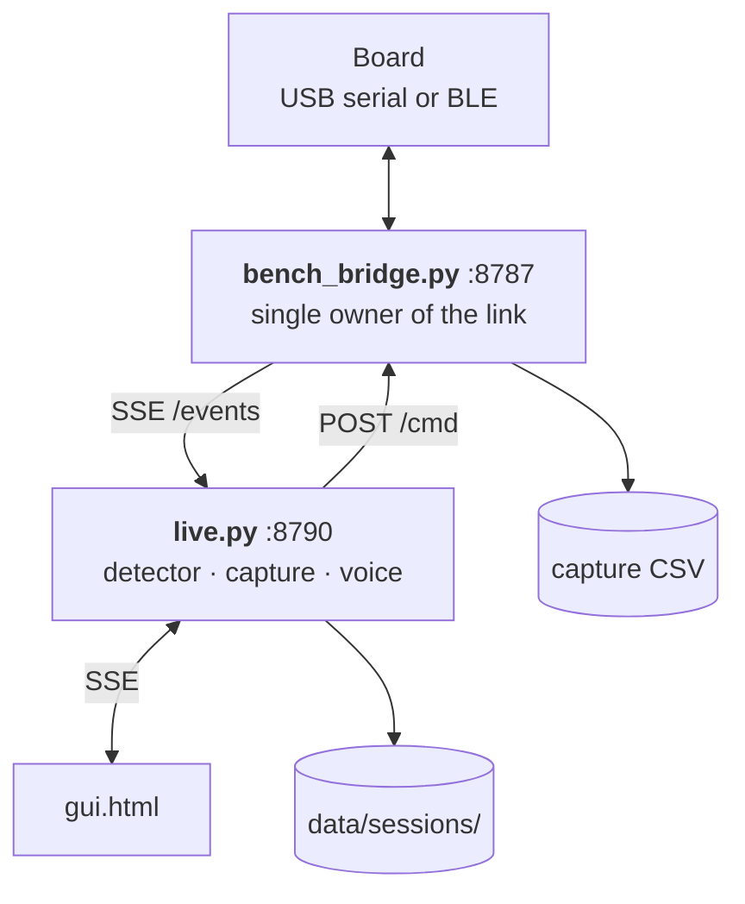

# 03 · Software

`software/onset-ml/` — Python 3.10+, runs on **macOS, Windows and Linux**.

<!--  -->

## Two processes



**`tools/bench_bridge.py`** owns the board and nothing else does. It prefers a USB serial port,
falls back to scanning for `Amulet-XPL` over Bluetooth, releases BLE if a USB board appears, and
reconnects indefinitely. It writes every line to the capture CSV and serves the raw stream as
Server-Sent Events on `:8787`.

`ONSET_PREFER_BLE=1` keeps it on Bluetooth even when USB is attached — useful when the board is
plugged in only to charge.

**`live.py`** subscribes to that stream and does the thinking: features, detection, cue decisions,
session filing, voice reports. Serves the cockpit on `:8790`.

## Setup

### macOS / Linux

```bash
cd software/onset-ml
python3 -m venv .venv
.venv/bin/pip install -e ".[transcribe]"
make -C tools/apple_stt          # macOS 26+ only: faster local transcription, optional
```

### Windows

```powershell
cd software\onset-ml
python -m venv .venv
.venv\Scripts\pip install -e ".[transcribe]"
```

Everything works identically. Two platform notes:

- **Serial ports.** The bridge globs `/dev/cu.usbmodem*` on Unix and enumerates `COM*` on Windows.
- **Bluetooth.** `bleak` uses WinRT on Windows and CoreBluetooth on macOS. On macOS the terminal
  needs Bluetooth permission in System Settings → Privacy & Security.

### Running

```bash
.venv/bin/python tools/bench_bridge.py     # terminal 1
.venv/bin/python live.py                   # terminal 2
```

Then open <http://localhost:8790>.

## Module map

| File | Responsibility |
|:--|:--|
| `tools/bench_bridge.py` | Owns the board; capture CSV; SSE stream |
| `onset/parse.py` | Capture CSV → `Session` on a 100 Hz grid |
| `onset/features.py` | Causal features, one row per second |
| `train.py` | The detector |
| `evaluate.py` | Fixed scoring harness, leave-one-session-out |
| `onset/haptic.py` | Cue pattern schema, presets, energy guard |
| `onset/session.py` | Files a finished session, appends to the ledger |
| `onset/voicenote.py` | Record → download → WAV state machine |
| `onset/transcribe.py` | Local speech-to-text with a VAD gate |
| `onset/journal.py` | Writes the transcript `.txt` |
| `rssi_capture.py`, `rssi_report.py` | RSSI capture and per-session reports |
| `session_view.py` | Whole-session review page |
| `tools/fake_board.py` | Board simulator — the stack runs with no hardware |

## Transcription

**Entirely local. Nothing is uploaded to any service.** A study cannot promise participants
confidentiality while shipping their audio to a third party, so there is no cloud backend and no
API key anywhere in this codebase.

| Backend | Platforms | Notes |
|:--|:--|:--|
| **`faster_whisper`** | **Windows · macOS · Linux** | The portable default. CPU only, one `pip install` |
| `apple` | macOS 26+ | Apple SpeechAnalyzer via `tools/apple_stt`. No model download; **0.15 s for a 3 s clip**. Preferred when present |
| `parakeet`, `mlx_whisper` | Apple silicon | Optional accelerated alternatives |
| `whisper` | any | Reference implementation, slowest |

The order is chosen per platform: Apple first on macOS, `faster_whisper` everywhere else. Override
with `ONSET_STT=faster_whisper`.

```bash
.venv/bin/python transcribe_notes.py --backends          # what is installed
.venv/bin/python transcribe_notes.py --all               # transcribe new takes
.venv/bin/python transcribe_notes.py --compare take.wav  # every engine side by side
```

### The VAD gate

**Every clip passes an energy voice-activity check before any recogniser sees it.**
Whisper-family models are known to emit training-set subtitle text over silence — "Thank you for
watching!" and similar. In a research corpus that failure is invisible and unfalsifiable, which
makes it worse than no transcript at all. A clip with no speech returns `no_speech` and is
recorded as such. The WAV is always kept; the transcript is derived data.

### Getting good audio

The recogniser is the easy part; the recording is not. Two things matter:

- **Murmur, do not whisper.** Whispering removes the fundamental frequency that every recogniser
  relies on. Published figures put Whisper-v3 at 18.9 % character error on whispered speech
  against 4.0 % on normal speech. A quiet *voiced* murmur is fine.
- **Raise the mic gain instead of your voice.** `g` cycles the gain 0 → 20 → 40 → 60 → 80.

## Working without hardware

```bash
.venv/bin/python tools/fake_board.py --port 8799
ONSET_BRIDGE=http://localhost:8799 .venv/bin/python live.py --port 8798
curl -s localhost:8799/button -d '{"clicks":1}'
```

The simulator speaks the bridge contract exactly, emits every line type, and synthesises real
speech so the transcription path can be exercised end to end.
