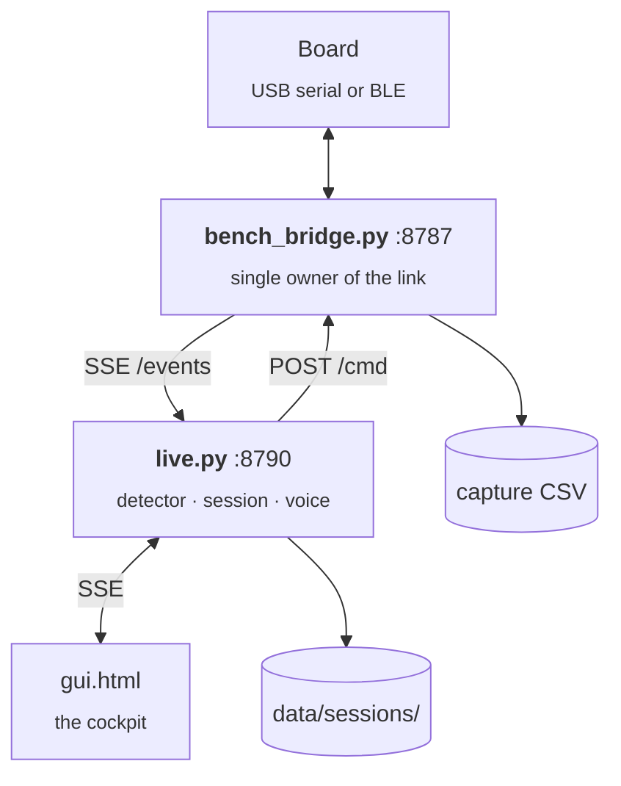
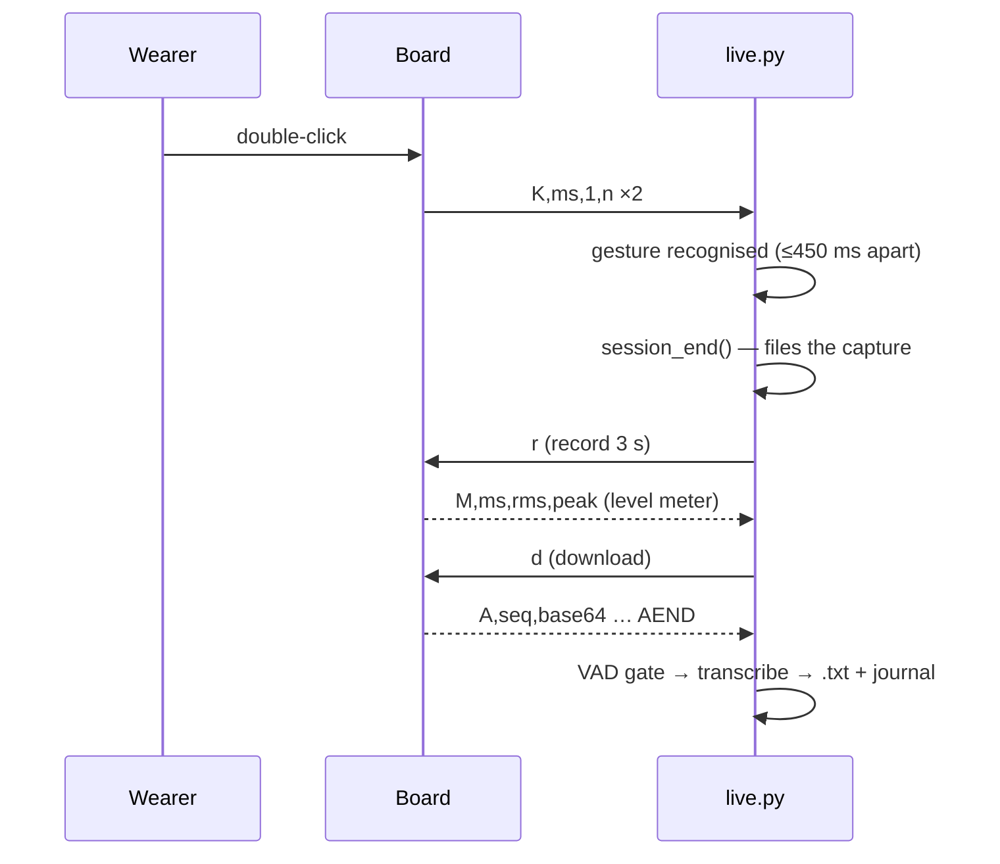

# 05 · Software

Everything in `software/onset-ml/`. Python 3.12, `uv` venv at `.venv`.

<!--  -->

## Two processes



**`tools/bench_bridge.py`** owns the board and nothing else does. It prefers `/dev/cu.usbmodem*`,
falls back to scanning for `Amulet-XPL` over Bluetooth, releases the BLE link if a USB board
appears, and reconnects forever. It serves a dashboard at `/`, the raw line stream as Server-Sent
Events at `/events`, and accepts `POST /cmd`, `/record`, `/note`.

Set `ONSET_PREFER_BLE=1` to stay on Bluetooth even when USB is attached — useful when the board is
plugged in only to charge.

**`live.py`** subscribes to that stream and does the thinking: features, detector, cue decisions,
session filing, voice notes. It serves the cockpit and its own event stream on `:8790`.

## Module map

| File | Responsibility |
|:--|:--|
| `onset/parse.py` | Capture CSV → `Session` (100 Hz grid, beats, notes) |
| `onset/features.py` | ~22 causal features, one row per second |
| `train.py` | The detector. `MODEL = 'dormio'` or `'logreg'` |
| `evaluate.py` | **Fixed** scoring harness: leave-one-session-out, checks causality |
| `thresholds.py` | Reproduces the Dormio paper's threshold table from your own reports |
| `onset/haptic.py` | Cue pattern schema, presets, energy guard, preview |
| `onset/session.py` | Files a finished session and appends to the ledger |
| `onset/voicenote.py` | Record → download → WAV state machine |
| `onset/transcribe.py` | Multi-backend speech-to-text with a VAD gate |
| `onset/journal.py` | Writes the transcript `.txt` and the dream journal |
| `session_view.py` | Whole-session review page |
| `tools/fake_board.py` | A board simulator — the whole stack runs with no hardware |

> `evaluate.py` is deliberately fixed. It is the referee. The autoresearch loop in `program.md`
> may edit `train.py` and `onset/features.py` and nothing else, so improvements are measured
> against a target that does not move.

## The detector

Once a second, features are computed over trailing windows and z-scored against the first 120 s.
The default `MODEL = 'dormio'` reproduces Horowitz et al. 2020 §2.2: fire on
`|ΔHR| > 5 bpm` **or** `|Δflex| > 8 kΩ`. The score must hold above threshold for `HOLD_S` (8 s);
after a cue, `REFRACTORY_S` (60 s) blocks the next one.

> ⚠️ **The baseline is computed once and never revisited.** If the sensor physically moves, the
> deviation becomes permanent and the detector fires every refractory window forever. This is not
> hypothetical — see [09 · Troubleshooting](09-troubleshooting.md).

## Voice notes

A double-click on the glove button ends the session and records a spoken report:



### Transcription

On-device by default. A dream report is about as private as data gets, so nothing leaves the
machine unless you deliberately configure it to.

| Backend | Notes |
|:--|:--|
| **`apple`** | Apple SpeechAnalyzer via `tools/apple_stt`. Default. No model download. **0.15 s for a 3 s clip** |
| `parakeet` | `parakeet-mlx`, ~24× realtime on Apple silicon |
| `mlx_whisper` / `faster_whisper` / `whisper` | Whisper family, if installed |
| `wispr` | Wispr Flow cloud API. **Off unless `WISPR_API_KEY` is set and `wispr` is named explicitly** |

```bash
.venv/bin/python transcribe_notes.py --backends          # what is installed
.venv/bin/python transcribe_notes.py --all               # transcribe new notes
.venv/bin/python transcribe_notes.py --compare note.wav  # every engine side by side
ONSET_STT=apple,mlx_whisper .venv/bin/python live.py     # pin the order
```

**Every clip passes an energy VAD before any decoder sees it.** Whisper-family models are known to
emit training-set subtitle text over silence, and a fabricated dream report is worse than no dream
report — it is unfalsifiable contamination of a research dataset. A clip with no speech returns
`no_speech` and is recorded as such.

Measured on an M4 Max: a clip attenuated 16× with added noise transcribed perfectly; a
phase-randomised clip with the fundamental frequency stripped (the acoustic signature of
whispering) also transcribed perfectly; three seconds of mic noise floor returned an empty string
rather than an invented sentence.

> **Murmur, don't whisper.** A quiet *voiced* murmur keeps the fundamental frequency and stays in
> distribution. True whispering removes it, and published figures put Whisper-v3 at 18.93 % CER on
> whispered speech against 3.95 % on normal speech. Raise the mic gain with `g` instead of
> lowering your voice.

## Developing without hardware

```bash
.venv/bin/python tools/fake_board.py --port 8799
ONSET_BRIDGE=http://localhost:8799 .venv/bin/python live.py --port 8798
curl -s localhost:8799/button -d '{"clicks":2}'     # fire the gesture
```

The simulator speaks the bridge contract exactly, emits every line type, and synthesises real
speech via `say` so the transcription path can be exercised end to end.
